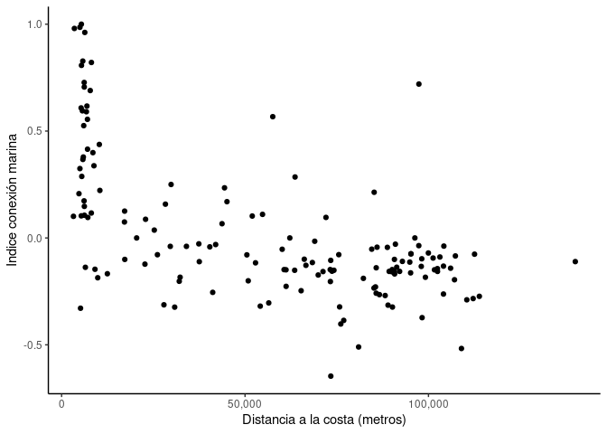

<!-- README.md is generated from README.Rmd. Please edit that file -->

# MarineIndex

<!-- badges: start -->
<!-- badges: end -->

The goal of MarineIndex is to develop a index of people connections with
the sea. In **Idea.R** we extract information of Wikipedia as peoples’s
perceptions. With the code we detected all cities from Chile and we made
an screaping to extract all the words of each city’s text.

An app was created to input values to all words detected: marine +1,
terrestrial -1, and neutral words 0. See folder **TestApp**

In **Relaciones indice marino.R** we related marine index with possible
explanatory variables. We used *DistCosta_Chile.rds* and *Indice.rds*.

``` r


ggplot(Validacion_Indice) + geom_point(aes(x=Dist_Costa, y=Index)) +  scale_colour_continuous()+
  ylab("Indice conexión marina")+ xlab("Distancia a la costa (metros)")+ 
  scale_x_continuous(label = scales::comma)+ theme_classic()
```

<!-- -->

You’ll still need to render `README.Rmd` regularly, to keep `README.md`
up-to-date. `devtools::build_readme()` is handy for this. You could also
use GitHub Actions to re-render `README.Rmd` every time you push. An
example workflow can be found here:
<https://github.com/r-lib/actions/tree/v1/examples>.

## GEDI

In that case, don’t forget to commit and push the resulting figure
files, so they display on GitHub.
